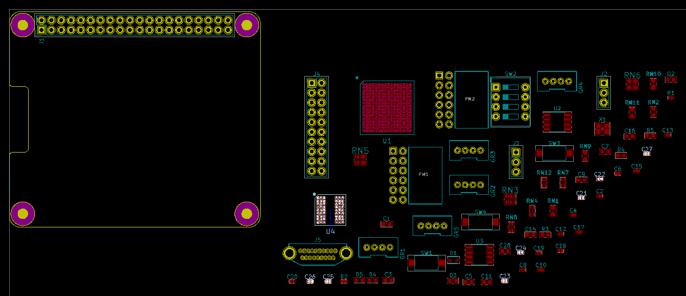
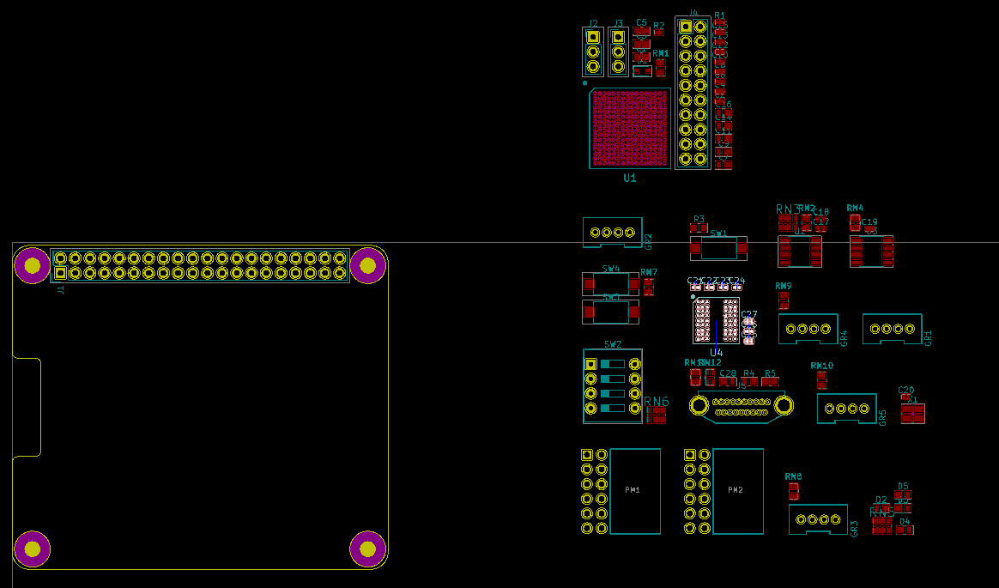

# XESS Hierarchical Placement Plugin

This PCBNEW plugin arranges the parts into groups that reflect
the hierarchy in the design.

* Free software: MIT license

## Features

* Creates an arrangement of the parts that reflects their level in the design hierarchy.
* Will arrange only the parts that have been selected or, if no parts are selected, the entire design.
* Will not move locked parts.

## Installation

On linux, just copy `HierPlace.py` to your local `~/.kicad_plugins` directory.

## Usage

There are two ways to use this plugin:

1. Press the `Tools => External Plugins... => HierPlace` button and all the unlocked
   parts will be arranged.

2. Select a subset of the parts and press the `HierPlace` button and only the unlocked
   parts in the selection will be arranged.

### Example

Here is an example of an initial arrangement of parts in PCBNEW.
The SDRAM BGA and its seven decoupling capacitors are highlighted to show
how widely separated they are. Other sections of the circuitry are similarly scattered.

The arrangement after running `HierPlace` is shown below.
Now the SDRAM and its decoupling capacitors are closely grouped, as are the
other sections of the circuitry.

## Credits

### Development Lead

* XESS Corp. <info@xess.com>

### Contributors

None yet. Why not be the first?
